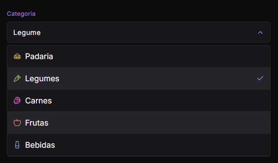

<!-- Projeto Finalizado -->
# 🔽 Soft Dropdown
<p align="center">
  <!-- Contador de linguagens do GitHub -->
  
  <!-- Tamanho do repositório no GitHub -->
  
  <!-- Licença do GitHub -->
  
</p>

<div align="center">
  
</div>

## 🎯 Objetivo do Projeto
O **Soft Dropdown** é um projeto desenvolvido com HTML, CSS e JavaScript, que tem como objetivo criar um dropdown interativo para seleção de categorias. Ele permite que o usuário selecione uma categoria de uma lista pré-definida, oferecendo uma experiência dinâmica e fluida.

## ⚙️ Como Funciona
- **Interatividade**: O dropdown exibe e seleciona categorias de modo dinâmico, fechando automaticamente após clique.
- **Estilo Responsivo**: O design é moderno e adaptável a diferentes dispositivos.
- **Controle JavaScript**: Gerencia a exibição, seleção e acessibilidade do componente.

## 💻 Acessibilidade
O **Soft Dropdown** foi projetado com acessibilidade em mente. Ele suporta navegação via teclado, permitindo que usuários possam abrir e fechar o dropdown usando as teclas `Escape` e espaço. Além disso, o foco automático na opção selecionada facilita o uso para pessoas com deficiências visuais ou motoras, garantindo uma experiência inclusiva para todos os usuários.

## 🔍 Visualize o Projeto
Confira o projeto online através deste [link](https://devandreotti.github.io/soft-dropdown/).

## 🛠 Tecnologias Utilizadas
- **HTML5**: Base estrutural do dropdown e seus elementos.
- **CSS3**: Criação de um design responsivo com animações suaves.
- **JavaScript**: Implementação da lógica de interação do dropdown.
- **Lucide Icons**: Biblioteca utilizada para aprimorar a interface com ícones.

## 📚 Recursos Úteis
- [Lucide Icons](https://lucide.dev) - Biblioteca de ícones utilizada no projeto.

## 🧭 Guia de Implementação
1. **Clone o Repositório**
   ```bash
   git clone https://github.com/devAndreotti/soft-dropdown.git
   ```
2. **Abra o Projeto**
   - Abra o arquivo `index.html` em um navegador.

## 💪 Como Contribuir
Contribuições são bem-vindas! Siga estas etapas para colaborar:
1. Faça um fork do projeto.
2. Crie uma nova branch para sua feature: `git checkout -b feature/nome-feature`.
3. Commit suas mudanças: `git commit -m 'Adiciona nova feature'`.
4. Envie para a branch: `git push origin feature/nome-feature`.
5. Abra um Pull Request.

## 📝 Nota
Este projeto foi desenvolvido durante uma aula da **Rocketseat**. Fique à vontade para explorar, adaptar e expandir o que foi criado.
