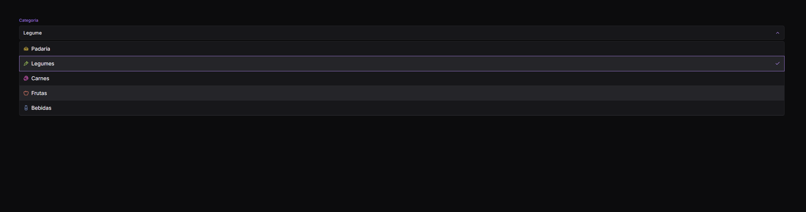

# Soft Dropdown

<p align="center">
  <!-- Contador de linguagens do GitHub -->
  
  <!-- Tamanho do repositório no GitHub -->
  
  <!-- Último commit no GitHub -->
  
  <!-- Licença do GitHub -->
  
</p>

<div align="center">
  
</div>

## 💻 Objetivo do Projeto

Este projeto consiste em criar um **dropdown com seleção de categorias** utilizando HTML, CSS e JavaScript. O dropdown permite ao usuário escolher uma categoria de uma lista, com interatividade e visualizações dinâmicas.

## ⚙️ Como Funciona

- **Interatividade**: O dropdown exibe uma lista de categorias quando o botão de seleção é clicado. A categoria selecionada é exibida no botão.
- **Estilo**: Utiliza CSS para criar um design moderno e responsivo.
- **JavaScript**: Controla a lógica de exibição e a seleção de opções.

## Visualize o Projeto

Você pode visualizar o projeto online através deste [link](https://devandreotti.github.io/soft-dropdown/).

## 🛠 Tecnologias Empregadas

- **HTML5**: Estrutura da aplicação e definição dos elementos do dropdown.
- **CSS3**: Estilos e animações para criar um design responsivo e atraente.
- **JavaScript**: Lógica para gerenciar a interação do dropdown e manipular a DOM.
- **Lucide Icons**: Biblioteca de ícones utilizada para melhorar a interface.

## Recursos Úteis

- [Lucide Icons](https://lucide.dev) - Biblioteca de ícones usada no projeto.

## 🧭 Guia de Implementação

1. **Clone o Repositório**
   ```bash
   git clone https://github.com/seu-usuario/dropdown-selecao.git
   ```

2. **Abra o Projeto**
   - Navegue para o diretório do projeto clonado.
   - Abra o arquivo `index.html` em um navegador.

3. **Instale as Dependências**
   - O projeto utiliza a biblioteca de ícones Lucide via CDN, portanto, não é necessário instalar dependências adicionais.

4. **Modifique o CSS e JS conforme Necessário**
   - Personalize o estilo e o comportamento do dropdown editando `style.css` e `dropdown.js`.

## 💪 Contribuição

Contribuições são bem-vindas! Para contribuir, siga estas etapas:

1. Faça um fork do projeto.
2. Crie uma nova branch para sua feature `git checkout -b feature/nome-feature`.
3. Commit suas mudanças `git commit -m 'Adiciona nova feature'`.
4. Envie para a branch `git push origin feature/nome-feature`.
5. Abra um Pull Request.

## 📝 Nota

Este projeto foi feito em uma aula da **Rocket Seat**. Sinta-se livre para explorar e adaptar.
